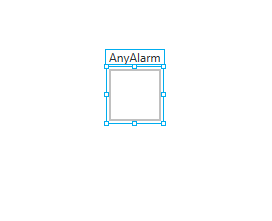
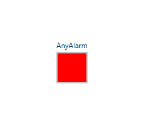
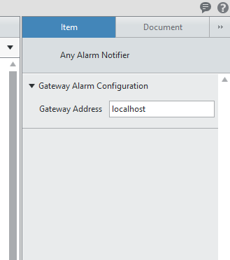

AnyAlarm Button
###############

The purpose of this indicator is to provide the user/operator with a total view of the status of alarms.

Instead of having a bunch of indicators, one for each alarm, you can have one indicator for all alarms.

.. note:: If your UI Screen is on a different machine to the operating VeriStand Gateway (Machine from which deployment occurs) then you must configure this in the indicator item configuration panel.

