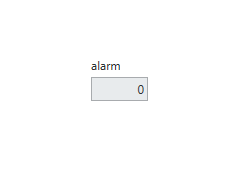
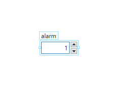
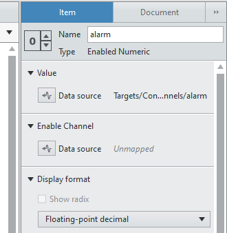

Enabled Numeric Control/Indicator
#################################

The purpose of this control is to allow a user/operator to control a channel value only if another channel value (say a no on an alarm or a enabled power button channel) is non zero.

This numeric was created because it was useful to only allow the operator to change channel values when an output was set to enabled/non-zero.

In the configuration panel you can configure the value channel and the enable channel.

.. note:: Due to a bug in VeriStand, the path, whilst selected, still won't appear as text in the data source control. Reset assured, it is still selected.

