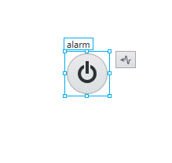
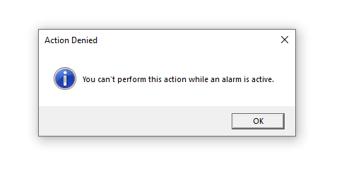
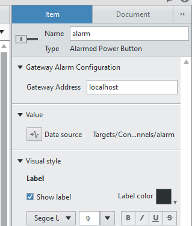

Enabled Power Button
####################

The Enabled Power Button was built for us to have a boolean control for controlling the power output of a system and to only allow the operator to do so if no alarm is currently active.

When the user attempts to toggle the output to on whilst an alarm is active, they will receive the following message:

.. note:: If your UI Screen is on a different machine to the operating VeriStand Gateway (Machine from which deployment occurs) then you must configure this in the indicator item configuration panel.

