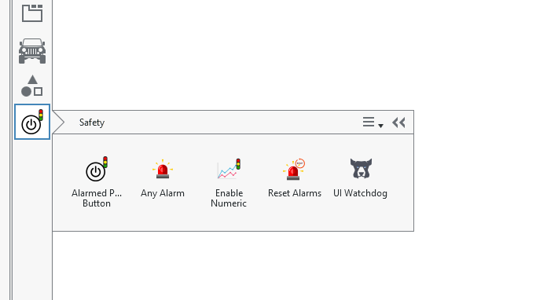

Installation
############

To install this plugin, start by downloading the plugin DLL available here:

https://github.com/sudilav/veristand-safety-controls/releases/tag/2024

Copy the DLL from your download location to the following location:

C:\\Users\\Public\\Documents\\National Instruments\\NI VeriStand 2024\\Custom UI Manager Controls

.. note:: Modify as per your version of VeriStand, note if you are using a version a release is not available for, you will need to rebuild the application and in project properties modify the Version number for VeriStand accordingly.

Once installed, the safety controls will be available in the left hand pane of the VeriStand Editor for screens:

