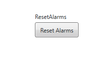
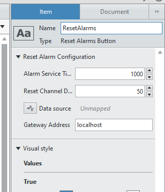

Reset Alarms
############

The reset alarms button provides an alternative to the Alarm Monitor/Manager panel.

It is a simple button that iterates through every alarm in the system, disables and re-enables them, this effectively resets the alarm.

The reason we created this is because we want the operator to reset alarms without the ability to disable them, we always want our alarms active and a combination of this button and disabling windows could achieve this.

.. note:: If your UI Screen is on a different machine to the operating VeriStand Gateway (Machine from which deployment occurs) then you must configure this in the indicator item configuration panel.

