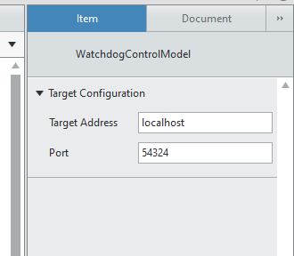

Watchdog
########

The purpose of this control is to act as a watchdog between the UI/GateWay and the Target.

The Target behaviour of a VeriStand controller is to keep running despite losing contact with the UI/Gateway, so instead we have implemented this watchdog.

You can then define the behaviour of the system based on an alarm and the instrument control device. Setup an instrument control device to use UDP to receive the packet from the UI and then setup an alarm on the message error code, so that a non-zero (typically 56) would result in an alarm.

You can configure the port and address to which packets are sent.

You cannot currently configure the period or content of packets. The period between packets is 500ms and the content is simply the string date time, it is not considered relevant the content of the packet but what the packet is.

By transmitting the datetime as a integer string it provides you with an incrementing value to plot against and track any drops in packets received.

Possible Instrument Control Configuration
^^^^^^^^^^^^^^^^^^^^^^^^^^^^^^^^^^^^^^^^^

Main Device Configuration:

Message Configuration:

Command Configuration:

Response Configuration:

Response Channel Configuration:

